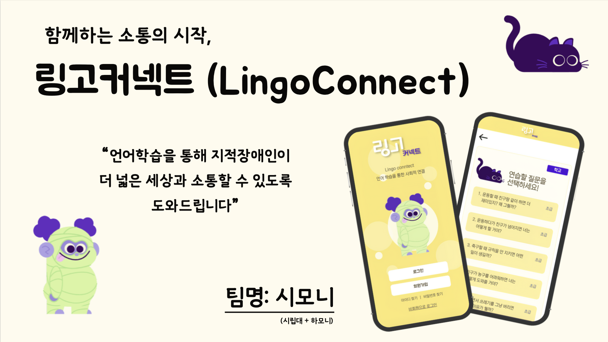
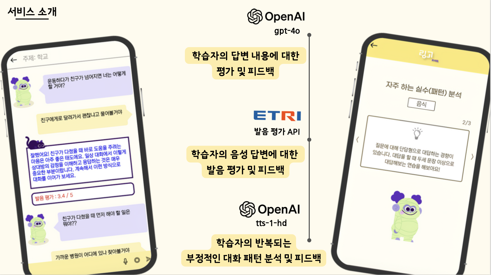

# 🗣️ 링고커넥트 (LingoConnect)

## 🔥 프로젝트 소개
- 언어학습을 통해 지적장애인이 더 넓은 세상과 소통할 수 있도록 도와주는 서비스입니다.
- 생성형 AI를 통해 현실감 있는 음성 대화가 가능하며, 대화 흐름과 발음에 대한 분석과 피드백을 제공합니다.
- 학습자에게 맞춤형으로 반복 학습을 지원하여 사회적인 소통 능력을 키우는 것을 목표로 합니다.
  
## 🌟 생성형 AI 활용 서비스
- 일상 대화와 공감형 대화 데이터를 학습한 생성형 AI를 사용합니다.
- 학습자의 음성을 텍스트로 인식하여 현실에 적용하기 쉬운 환경을 제공합니다.
- 대화의 흐름뿐만 아니라 발음에 점수를 매겨 시각적으로 성취를 이룰 수 있습니다.
- 마이페이지에서 학습자의 반복되는 부정적인 대화 패턴과 피드백을 제공합니다.

  
## 🚀 개발 기간
- 2024.07 - 
  
## 👨‍👩‍👧‍👦 팀원 구성
- 이예나 | Front-End | [@YenaLey](https://github.com/YenaLey)
- 주재원 | Back-End | [@jaewon-Ju](https://github.com/jaewon-ju)
- 김예영 | Front-End | [@yezzero](https://github.com/yezzero)
- 정윤하 | Design
  
## 💻 기술 스택
- Design
  - <a href="https://www.figma.com/design/gqZCozFYBEP1Yu1ThoLvMm/%EC%83%88%EC%8B%B9%ED%95%B4%EC%BB%A4%ED%86%A4?node-id=0-1&t=rPEXG1J575Ev7A3j-1">figma</a>
- Front-End
  - Language: JavaScript
  - Package Manager: npm 10.2.4
  - Library: React.js
- Back-End
  - Language: Java
  - Framework: Spring
  
## ⚙️ 브랜치 전략
1. **기능 개발**: `feature/` 브랜치에서 새로운 기능을 개발합니다. `release` 브랜치에서 분기하여 작업 후, `release` 브랜치로 병합합니다.
2. **버그 수정 및 릴리스 준비**: `release` 브랜치에서 검토 후 `main` 브랜치에 병합합니다.
